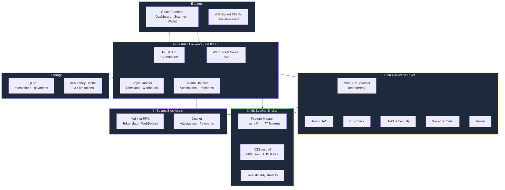
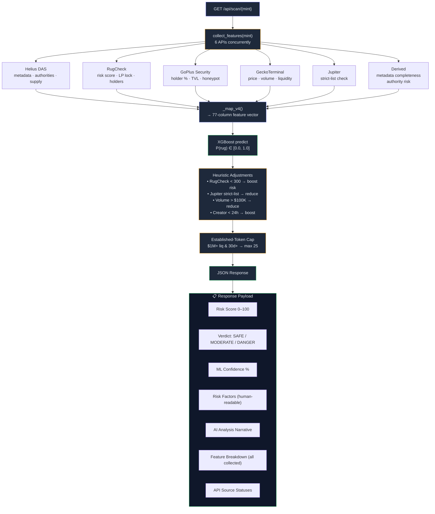
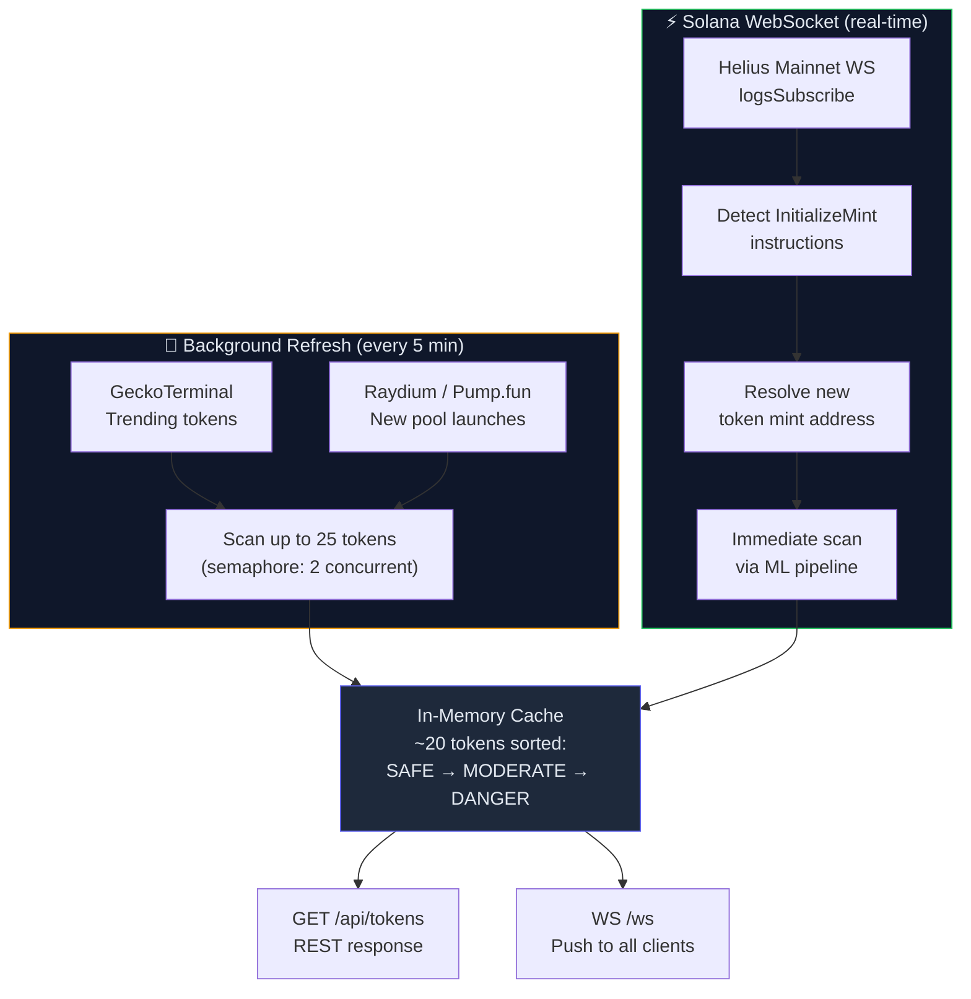
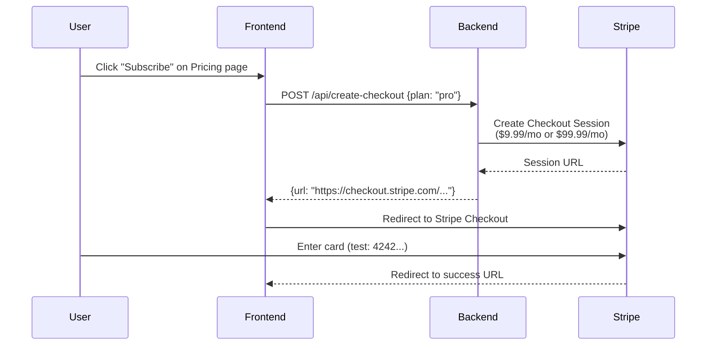
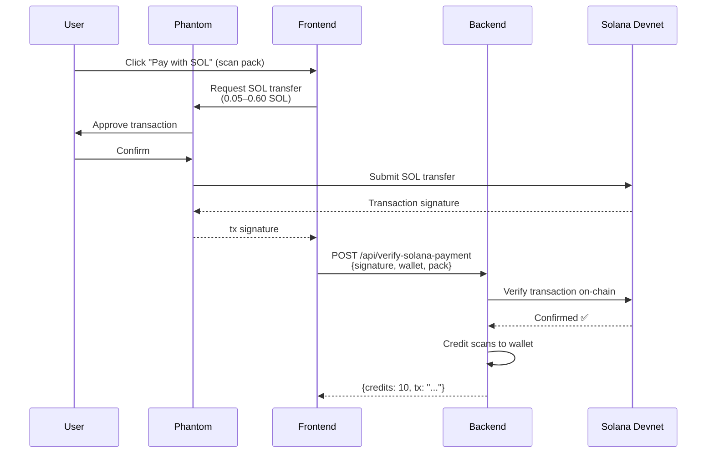
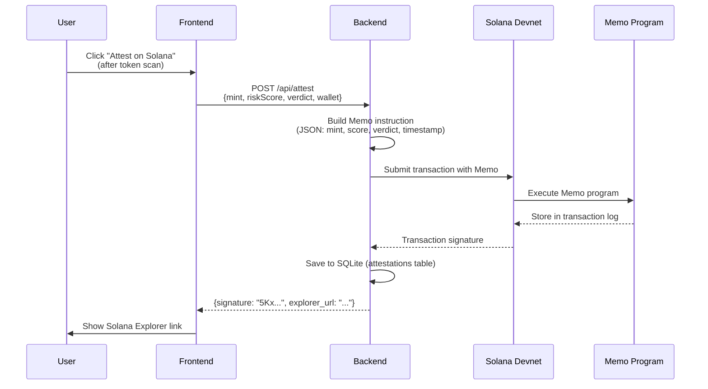

# Backend Architecture

> FastAPI backend powering DeFi Sentinel's real-time rug-pull detection.

---

## System Overview



**Start command:**
```bash
cd DeFiSentinel
PYTHONPATH=. python3 -m uvicorn backend.main:app --host 0.0.0.0 --port 8000
```

---

## API Endpoints (16 total)

### Token Scanning

| Method | Endpoint | Description |
|--------|----------|-------------|
| `GET` | `/api/scan/{mint}` | Scan a single token — collects features from 6 APIs, runs ML model, returns full risk breakdown |
| `GET` | `/api/tokens` | Returns cached list of ~20 live tokens for the dashboard feed |
| `POST` | `/api/tokens/refresh` | Triggers a background cache refresh and returns current tokens |
| `GET` | `/api/tokens/filter` | Filter cached tokens by `max_risk`, `min_liq`, `sort`, `limit` |

### Real-time Feed

| Method | Endpoint | Description |
|--------|----------|-------------|
| `WS` | `/ws` | WebSocket — pushes new token discoveries and cache updates in real-time |

### ML Model

| Method | Endpoint | Description |
|--------|----------|-------------|
| `GET` | `/api/model-stats` | Returns ML model metadata: version, feature count, AUC, top features |

### Payments & Billing

| Method | Endpoint | Description |
|--------|----------|-------------|
| `POST` | `/api/create-checkout` | Creates a Stripe Checkout session for plan subscriptions or scan packs |
| `POST` | `/api/verify-solana-payment` | Verifies a SOL payment on-chain and credits scans to the wallet |
| `GET` | `/api/credits/{wallet}` | Returns total scan credits for a wallet address |
| `GET` | `/api/payer-address` | Returns the treasury wallet address + SOL prices for scan packs |

### Solana & Attestations

| Method | Endpoint | Description |
|--------|----------|-------------|
| `POST` | `/api/attest` | Creates an on-chain risk attestation via Solana's Memo program |
| `GET` | `/api/attestations` | Lists all attestation records (optionally filtered by `?wallet=`) |
| `GET` | `/api/attestations/{mint}` | Lists attestations for a specific token mint |
| `POST` | `/api/auth/wallet` | Verifies a Phantom wallet signature for authentication |

### Wallet Analysis

| Method | Endpoint | Description |
|--------|----------|-------------|
| `GET` | `/api/wallet/{address}/balance/{mint}` | Checks if a wallet holds a specific SPL token |
| `GET` | `/api/wallet/{address}/risk-profile` | Scans ALL tokens in a wallet, scores each for rug risk, returns portfolio-level metrics |

---

## Data Flow: Token Scan

Full pipeline from user request to risk score — the core operation of the system.



---

## Data Flow: Live Token Feed

The dashboard uses two concurrent data sources to populate the real-time token feed:



---

## Scoring Pipeline Detail

The ML scorer (`backend/ml_scorer.py`) implements a multi-stage scoring process:

```
  ┌─────────────────────────────────────────────────────────────────────┐
  │                      SCORING PIPELINE STAGES                        │
  │                                                                     │
  │  Stage 1: Feature Mapping (_map_v4)                                │
  │  ├── Maps collector output → 77 XGBoost input columns              │
  │  ├── Uses np.nan for missing data (API failures, rate limits)      │
  │  └── Consistent ordering with models/feature_list_v4.json          │
  │                                                                     │
  │  Stage 2: XGBoost Prediction                                       │
  │  ├── Native NaN handling → routes missing features through          │
  │  │   learned optimal splits                                        │
  │  └── Output: P(rug) ∈ [0.0, 1.0]                                  │
  │                                                                     │
  │  Stage 3: Heuristic Adjustments                                    │
  │  ├── RugCheck score < 300      → risk boost                        │
  │  ├── Jupiter strict-list       → risk reduction                    │
  │  ├── 24h volume > $100K        → risk reduction                    │
  │  └── Creator wallet < 24h old  → risk boost                        │
  │                                                                     │
  │  Stage 4: Established-Token Cap                                    │
  │  ├── Liquidity > $1M AND pool age > 30 days                       │
  │  └── → max risk capped at 25 (blue-chip protection)               │
  │                                                                     │
  │  Stage 5: Fallback (if XGBoost unavailable)                        │
  │  └── Enhanced heuristic scoring using rule-based risk factors      │
  └─────────────────────────────────────────────────────────────────────┘
```

---

## Payment Flows

### Stripe Checkout



### SOL Payment



---

## On-Chain Attestation Flow



---

## Database Schema

SQLite (`defi_sentinel.db`) stores persistent state:

```
  ┌──────────────────────────────────────┐    ┌──────────────────────────────────┐
  │          attestations                 │    │           payments               │
  │──────────────────────────────────────│    │──────────────────────────────────│
  │  id           INTEGER PK             │    │  id           INTEGER PK         │
  │  mint         TEXT                    │    │  wallet       TEXT               │
  │  risk_score   INTEGER                │    │  tx_signature TEXT UNIQUE        │
  │  verdict      TEXT                    │    │  pack         TEXT               │
  │  wallet       TEXT                    │    │  credits      INTEGER            │
  │  tx_signature TEXT UNIQUE             │    │  amount_sol   REAL               │
  │  timestamp    TEXT                    │    │  timestamp    TEXT               │
  └──────────────────────────────────────┘    └──────────────────────────────────┘
```

---

## Environment Variables

| Variable | Required | Description |
|----------|----------|-------------|
| `HELIUS_API_KEY` | Yes | Helius API key for DAS + RPC calls |
| `STRIPE_SECRET_KEY` | Yes | Stripe test/live secret key |
| `SOLANA_PAYER_SECRET_KEY` | Yes | Base58-encoded keypair for attestation transactions |

---

## Dependencies

Key Python packages (`backend/requirements.txt`):

```
  ┌──────────────────┬────────────────────────────────────────┐
  │  Package          │  Purpose                               │
  ├──────────────────┼────────────────────────────────────────┤
  │  fastapi          │  Async web framework                   │
  │  uvicorn          │  ASGI server                           │
  │  httpx            │  Async HTTP client for 6 API sources   │
  │  xgboost          │  ML model inference                    │
  │  numpy            │  Feature array construction            │
  │  stripe           │  Payment processing                    │
  │  solders          │  Solana keypair & transaction building  │
  │  solana           │  Solana RPC client                     │
  │  python-dotenv    │  Environment variable loading          │
  │  websockets       │  Solana mainnet WebSocket listener     │
  └──────────────────┴────────────────────────────────────────┘
```
