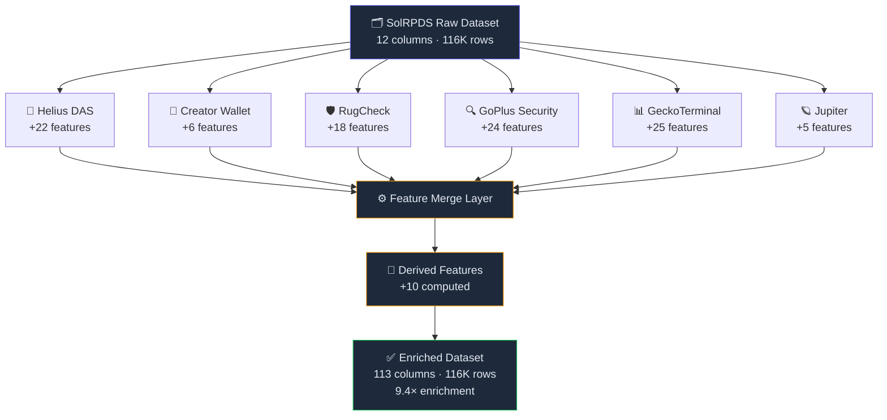
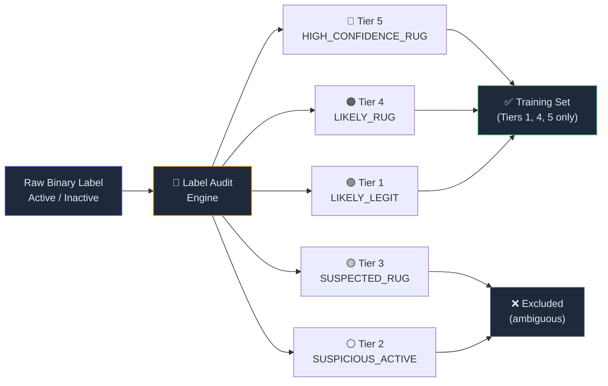
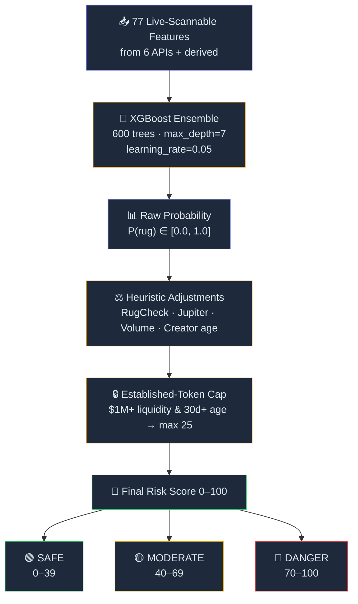
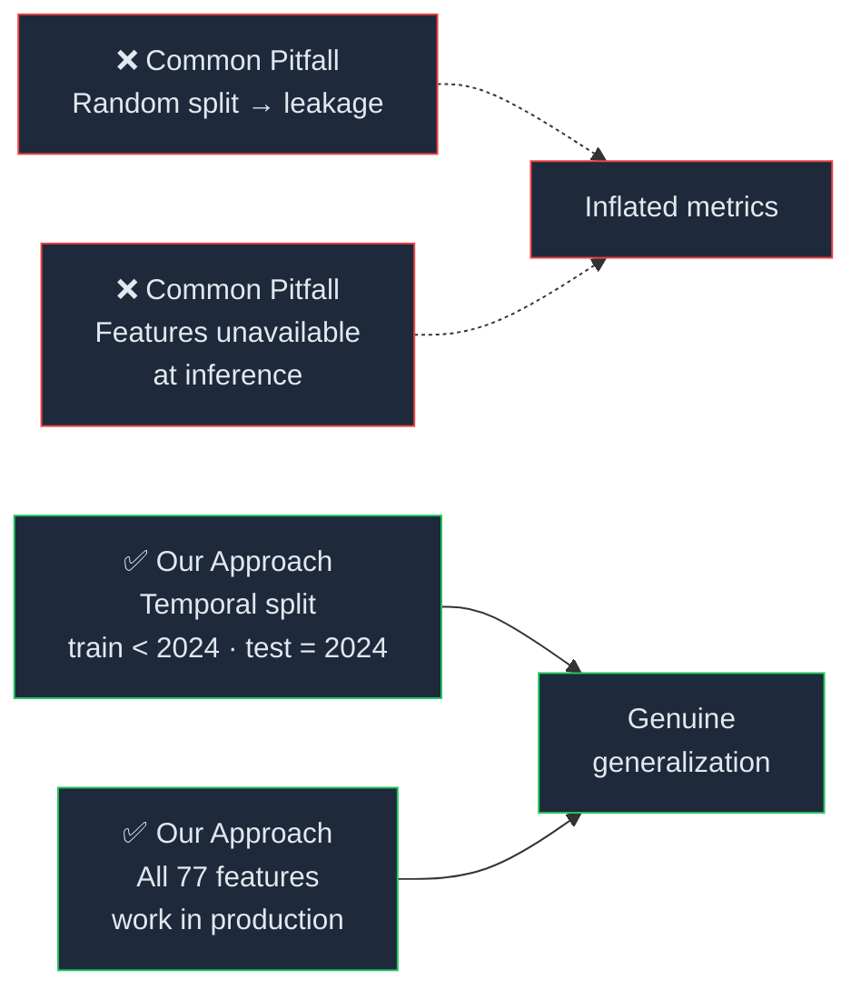
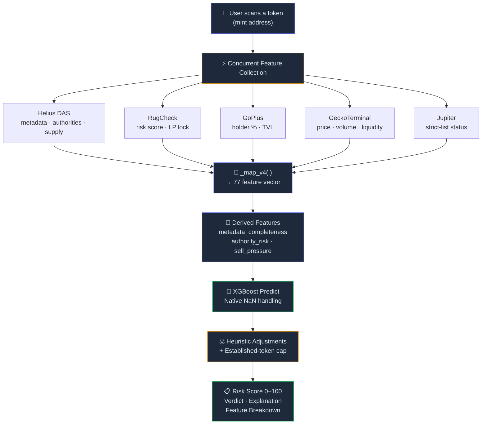

# Data Pipeline & ML Model

> How DeFi Sentinel collects, enriches, and scores token data for rug-pull detection.

---

## 1. The Dataset: SolRPDS

Our foundation is the **SolRPDS** dataset (Alhaidari et al., CODASPY 2025) — the first large-scale Solana rug-pull dataset:

| Metric | Value |
|--------|-------|
| Liquidity pool records | **116,308** |
| Unique token mints | **33,358** |
| Timespan | 2021 – Nov 2024 |
| Active (labeled legit) | **80.6%** |
| Inactive (labeled rug) | **19.4%** |

**Key insight from our audit:** The paper's binary label uses *inactivity* as a proxy for rug pulls, but 67.4% of "Active" tokens also had ≥95% liquidity drained. This means the raw labels have significant noise. We address this with confidence-scored labels (see §3).

> 📄 **Citation:** Alhaidari et al., "SolRPDS: A Solana Rug-Pull Detection System," CODASPY 2025.

### Dataset Class Distribution

```
  Active (Legit)  ██████████████████████████████████████████  80.6%  (93,736)
  Inactive (Rug)  ██████████                                  19.4%  (22,572)
                  0%       20%       40%       60%       80%      100%
```

### Raw Label Quality Problem

```
                    ┌─────────────────────────────────────────────┐
                    │         "Active" Tokens (93,736)            │
                    │                                             │
                    │   ┌───────────────────────────────────┐     │
                    │   │  67.4% have ≥95% liquidity        │     │
                    │   │  drained — FALSE NEGATIVES         │     │
                    │   │  (labeled legit but actually       │     │
                    │   │   behave like rug pulls)           │     │
                    │   └───────────────────────────────────┘     │
                    │                                             │
                    │   32.6% genuinely active with               │
                    │   balanced trading                          │
                    └─────────────────────────────────────────────┘
                    ┌─────────────────────────────────────────────┐
                    │        "Inactive" Tokens (22,572)           │
                    │                                             │
                    │   ~10-17% are dead projects,                │
                    │   NOT scams — FALSE POSITIVES               │
                    └─────────────────────────────────────────────┘
```

---

## 2. Multi-Source Enrichment Pipeline

We enriched the dataset from **12 raw columns to 113 features** — a **9.4× enrichment factor** — using 6 independent data sources.

### Enrichment Architecture



### Feature Sources Breakdown

| Source | Features | Auth | Key Signals |
|--------|----------|------|-------------|
| **Helius DAS** | 22 | API key | Token metadata, authorities, supply, price |
| **Creator Wallet** (Helius) | 6 | Same key | Wallet age, transaction count, prior rugs |
| **RugCheck** | 18 | Free | Risk score, LP lock status, holder concentration |
| **GoPlus Security** | 24 | Free | Top-holder %, TVL, LP distribution, honeypot flags |
| **GeckoTerminal** | 25 | Free | Live price, volume, pool liquidity, buy/sell ratio |
| **Jupiter** | 5 | Free | Listing status (strict-list = strong legitimacy signal) |
| **Derived** | 10 | Computed | Metadata completeness, authority risk, sell pressure |

### Feature Count by Source

```
  Helius DAS       ████████████████████████                  22
  Creator Wallet   ████████                                   6
  RugCheck         ████████████████████                      18
  GoPlus Security  ██████████████████████████                24
  GeckoTerminal    ███████████████████████████               25
  Jupiter          ███████                                    5
  Derived          ████████████                              10
  Raw (original)   ██████████████                            12  (base)
                   ─────────────────────────────────────
                   TOTAL UNIQUE:  113 enriched features
```

### Enrichment Process

1. **Helius DAS batch enrichment** — Retrieved on-chain metadata for all 33,358 mints (100% coverage): token name, symbol, supply, authorities, mutability, metadata URI
2. **RugCheck** — Independent risk scores and LP lock analysis for prioritized subset
3. **GoPlus Security** — Raw on-chain holder distribution, TVL, LP count. **Key finding:** numeric features (holder %, TVL) are near-perfect rug separators, while binary flags (mintable, freezable) are misleading
4. **GeckoTerminal** — Live pool data: price, volume, liquidity reserves, buy/sell transaction counts
5. **Jupiter** — Verified token listing status (strict-list tokens are almost never rugs)
6. **Derived features** — Computed from the above: `metadata_completeness`, `authority_risk_score`, `sell_pressure_score`, `consensus_risk`

### Novel Finding: Metadata URI Domain as Rug Indicator

```
  gateway.pinata.cloud  ██████████████████████████████████████████████████  98.9%  rug
  gateway.irys.xyz      ███████████████████████████████████████████████     85.7%  rug
  cdn.dexscreener.com   ████████████████████████████████████                72.0%  rug
  No URI (older tokens) ████████████                                        23.7%  rug
                        ─────────────────────────────────────────────────
                        0%       20%       40%       60%       80%      100%
```

> Cheap/free hosting services used by pump.fun rug factories have dramatically higher rug rates — a feature no existing detector uses.

---

## 3. Label Quality & Confidence Scoring

The raw "Inactive = rug" label has ~10–17% false positives (dead projects, not scams) and thousands of false negatives (drained tokens with one final arbitrage trade that kept them "Active"). We replace the binary label with a **5-tier confidence score**:

### Confidence Tier System



| Tier | Label | Criteria | Training? |
|------|-------|----------|-----------|
| 5 | HIGH_CONFIDENCE_RUG | Inactive + <24h lifespan + ≤2 txns + >90% drained | ✅ Yes |
| 4 | LIKELY_RUG | Inactive + <7d lifespan + >50% drained | ✅ Yes |
| 3 | SUSPECTED_RUG | Inactive + ambiguous signals | ❌ Excluded |
| 2 | SUSPICIOUS_ACTIVE | Active but >90% drained + few transactions | ❌ Excluded |
| 1 | LIKELY_LEGIT | Active + balanced trading + sustained activity | ✅ Yes |

> Training uses only high-confidence labels (tiers 1 and 4–5) to maximize signal quality and avoid noisy supervision.

---

## 4. Feature Importance (Top 10)

### Importance Distribution

```
  derived_metadata_completeness  ████████████████████████████████████████████████████████  53.9%
  feat_name_is_empty             █████████████                                            13.1%
  feat_name_length               █████████                                                 9.4%
  feat_name_frequency            █████████                                                 9.0%
  feat_symbol_frequency          ██                                                        2.3%
  IS_MUTABLE                     ██                                                        2.1%
  feat_name_has_scam_word        ██                                                        2.0%
  HAS_JSON_URI                   █                                                         1.6%
  v4_metadata_quality            █                                                         1.4%
  NUM_LIQUIDITY_ADDS             █                                                         1.3%
                                 ─────────────────────────────────────────────────────────
                                 0%        10%        20%        30%        40%        50%
```

| Rank | Feature | Importance | What It Captures |
|------|---------|------------|------------------|
| 1 | `derived_metadata_completeness` | **53.9%** | Composite: image + description + website + social links |
| 2 | `feat_name_is_empty` | **13.1%** | Empty token name = low-effort rug factory output |
| 3 | `feat_name_length` | **9.4%** | Short/generic names correlate with scams |
| 4 | `feat_name_frequency` | **9.0%** | Duplicated names = copycat tokens |
| 5 | `feat_symbol_frequency` | **2.3%** | Duplicate symbols |
| 6 | `IS_MUTABLE` | **2.1%** | Mutable metadata = can change token identity |
| 7 | `feat_name_has_scam_word` | **2.0%** | Contains "moon", "elon", "safe", "1000x" |
| 8 | `HAS_JSON_URI` | **1.6%** | Pump.fun auto-generates URIs |
| 9 | `v4_metadata_quality` | **1.4%** | Composite metadata + authority check |
| 10 | `NUM_LIQUIDITY_ADDS` | **1.3%** | Single add = textbook rug setup |

### Key Insight: The Effort Signal

```
  ┌─────────────────────────────────────────────────────────────────┐
  │                    WHY METADATA DOMINATES                       │
  │                                                                 │
  │  Rug factory tokens (pump.fun):          Legit tokens:          │
  │  ╭──────────────────────────╮           ╭──────────────────╮    │
  │  │  ❌ No image              │           │  ✅ Custom image   │    │
  │  │  ❌ No description        │           │  ✅ Description    │    │
  │  │  ❌ No website            │           │  ✅ Website        │    │
  │  │  ❌ No social links       │           │  ✅ Twitter/TG     │    │
  │  │  ❌ Generic name          │           │  ✅ Unique name    │    │
  │  │  ❌ Mutable metadata      │           │  ✅ Immutable      │    │
  │  ╰──────────────────────────╯           ╰──────────────────╯    │
  │                                                                 │
  │  → The "effort signal" — did the creator invest time? — is      │
  │    more predictive than any single on-chain economic metric.    │
  └─────────────────────────────────────────────────────────────────┘
```

---

## 5. XGBoost v4 — Production Model

### Model Architecture



### Training Configuration

| Parameter | Value |
|-----------|-------|
| Algorithm | XGBoost (gradient-boosted trees) |
| Features | **77** (all available at live scan time) |
| Target | Binary: RUG vs LEGIT (high-confidence labels only) |
| Split | **Temporal**: train < 2024, test = 2024 |
| Train set | 19,512 rows |
| Test set | 28,557 rows (unseen 2024 tokens) |
| Trees | 600, max_depth=7, learning_rate=0.05 |
| Missing values | XGBoost native NaN handling |

### Results

```
                    ┌─────────────────────────────────────────┐
                    │        MODEL PERFORMANCE METRICS        │
                    │                                         │
                    │   AUC-ROC          ██████████  0.9990   │
                    │   Average Prec.    ██████████  0.9985   │
                    │   Optimal F1       █████████▉  0.9861   │
                    │   MCC              █████████▊  0.9738   │
                    │                    ──────────           │
                    │                    0.0    0.5    1.0    │
                    │                                         │
                    │   Optimal Threshold: 0.308              │
                    └─────────────────────────────────────────┘
```

| Metric | Value |
|--------|-------|
| **AUC-ROC** | **0.9990** |
| **Average Precision** | **0.9985** |
| **Optimal F1** | **0.9861** |
| **MCC** | **0.9738** |
| **Optimal Threshold** | **0.308** |

### Why These Results Are Real (Not Inflated)



1. **Temporal split** — model trained on pre-2024 data, tested on 28K unseen 2024 tokens
2. **No deployer leakage** — v3 had 89% importance from deployer features unavailable at scan time; v4 uses only live-scannable features
3. **All 77 features work in production** — no gap between training and inference
4. **MCC of 0.974** confirms genuine predictive power, not class-imbalance inflation

### Model Evolution

```
  v1  AUC 0.9736  ████████████████████████████████████████████████▊       36 features · Limited scope
  v2  AUC 0.9891  █████████████████████████████████████████████████▊      52 features · + external APIs
  v3  AUC 0.9995  ██████████████████████████████████████████████████      89 features · ⚠️ deployer leakage
  v4  AUC 0.9990  █████████████████████████████████████████████████▉      77 features · ✅ production-ready
                  ───────────────────────────────────────────────────
                  0.96      0.97      0.98      0.99      1.00
```

| Version | AUC | Features | Status |
|---------|-----|----------|--------|
| v1 | 0.9736 | 36 | Limited features |
| v2 | 0.9891 | 52 | + external APIs |
| v3 | 0.9995 | 89 | ⚠️ 89% importance from unavailable deployer features |
| **v4** | **0.9990** | **77** | **✅ All features available in production** |

---

## 6. Live Scoring Pipeline



Steps:

1. **Collect features** from 6 APIs concurrently (Helius, RugCheck, GoPlus, GeckoTerminal, Jupiter, derived)
2. **Map features** to the 77 model input columns via `_map_v4()`
3. **XGBoost prediction** — native NaN handling for any missing API data
4. **Heuristic adjustment** — light boost/penalty for strong live signals
5. **Established-token cap** — tokens with $1M+ liquidity and 30d+ age capped at risk ≤25
6. **Graceful degradation** — if ML model fails to load, falls back to enhanced heuristic scoring

The model file is `models/model_v4.json` with feature names in `models/feature_list_v4.json`.

---

## 7. Summary

```
  ┌───────────────────────────────────────────────────────────────────┐
  │                     DATA & ML PIPELINE SUMMARY                    │
  │                                                                   │
  │  📊 Dataset         116,308 pool records · 33,358 mints          │
  │  🔗 Data Sources    6 independent APIs + derived features         │
  │  📈 Enrichment      12 → 113 features (9.4× enrichment)          │
  │  🏷️  Labels          5-tier confidence scoring (not raw binary)   │
  │  🧪 Split           Temporal: pre-2024 train → 2024 test         │
  │  🌳 Model           XGBoost · 600 trees · 77 production features │
  │  📏 AUC-ROC         0.999 on 28,557 unseen test tokens           │
  │  ✅ Production       All features available at live inference     │
  │  🔄 Fallback        Heuristic scorer if ML model fails           │
  └───────────────────────────────────────────────────────────────────┘
```
